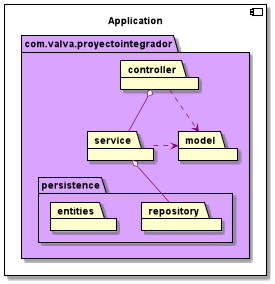
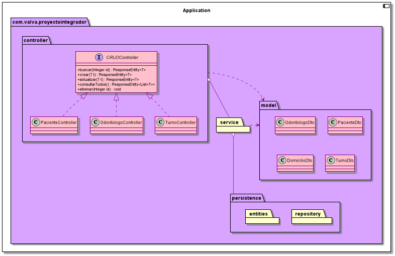
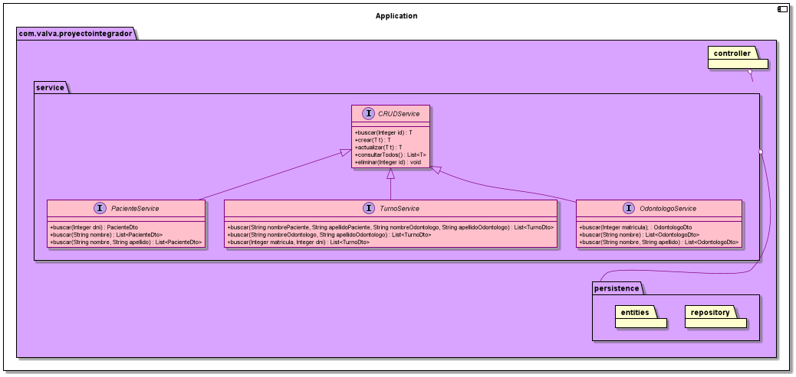
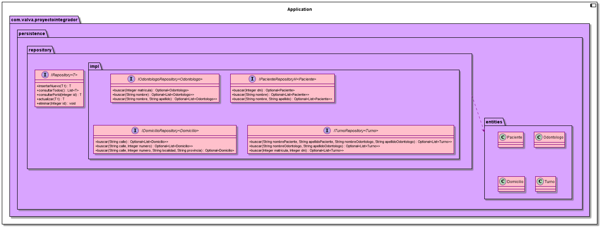

[![Build Status][build-shield]][build-url]
[![Codacy Status][codacy-shield]][codacy-url]

# CTD-BE1 - Proyecto Integrador: Clínica Odontológica

El proyecto es una API REST de una clínica odontológica en proceso.

Una vez que la aplicación esté corriendo, podés acceder a la url [http://localhost:8080/swagger-ui.html](http://localhost:8080/swagger-ui.html)
y ver la documentación. De cualquier manera también está en la sección [Endpoints](#endpoints).

Como la vista todavía es un trabajo en proceso, dejo el archivo `clinica-odontologica.postman_collection` donde están las pruebas realizadas desde Postman. 
El primer request que hay que hacer para que el resto funcionen es alguno de los logins.

## Pre-requisitos
-  [Maven](https://maven.apache.org/download.cgi)
-  [Java 11](https://www.oracle.com/java/technologies/downloads/#java11)

## Instalación
Por defecto Tomcat se levanta en el puerto 8080, si se quisiera configurar un puerto personalizado agregar `server.port=<PUERTO>`
en `/src/resources/application.properties`.

Una vez clonado el proyecto ejecutar el comando:
```bash
mvn clean package
java -jar ClinicaOdontologica.jar
```

## UML








## Endpoints
### Odontólogos

-  Buscar por id: `GET` a `PATH/odontologos/{id}`
    -  `200 OK` → devuelve el odontólogo
    -  `404 NOT FOUND` → no se encontró un odontólogo con ese ID

-  Buscar por dni: `GET` a `PATH/odontologos/?matricula=123`
    -  `200 OK` → devuelve el odontólogo
    -  `400 BAD REQUEST` → hubo un error en los datos recibidos
    -  `404 NOT FOUND` → no se encontró un odontólogo con esa matrícula

-  Buscar por nombre: `GET` a `PATH/odontologos/?nombre=Pepe`
    -  `200 OK` → devuelve todos los odontólogos con ese nombre
  
-  Buscar por nombre y apellido: `GET` a `PATH/odontologos/?nombre=Pepe&apellido=Pepardo`
    -  `200 OK` → devuelve todos los odontólogos con ese nombre y apellido

-  Registrar nuevo: `POST` a `PATH/odontologos`
    -  `200 OK` → se registró correctamente
    -  `400 BAD REQUEST` → hubo un error en los datos recibidos
          ```json
            {
                "nombre": "Pipo",
                "apellido": "Pipardo",
                "matricula": "123456"
            }
          ```
        
-  Actualizar existente: `PUT` a `PATH/odontologos`
    -  `200 OK` → se actualizó correctamente
    -  `400 BAD REQUEST` → hubo un error en los datos recibidos
    -  `404 NOT FOUND` → no se encontró el odontólogo con id recibido
          ```json
          {
              "id": "1",
              "nombre": "Pipo",
              "apellido": "Pipardisimo",
              "matricula": "654321"
          }
          ```
        
-  Eliminar por id: `DELETE` a `PATH/odontologos/{id}`
    -  `204 NO CONTENT` → se borró correctamente
    -  `404 NOT FOUND` → no se encontró el odontólogo con id recibido


-  Obtener todos: `GET` a `PATH/odontologos`
  
### Pacientes

-  Buscar por id: `GET` a `PATH/pacientes/{id}`
    -  `200 OK` → devuelve el paciente
    -  `404 NOT FOUND` → no se encontró un paciente con ese ID


- Buscar por dni: `GET` a `PATH/pacientes/?dni=123456789`
    - `200 OK` → devuelve el paciente
    - `400 BAD REQUEST` → hubo un error en los datos recibidos
    - `404 NOT FOUND` → no se encontró un paciente con ese DNI
      
    - Buscar por nombre: `GET` a `PATH/pacientes/?nombre=Pepe`
    - `200 OK` → devuelve todos los pacientes con ese nombre
    -  Buscar por nombre y apellido: `GET` a `PATH/pacientes/?nombre=Pepe&apellido=Pepardo`
    -  `200 OK` → devuelve todos los pacientes con ese nombre y apellido

-  Registrar nuevo: `POST` a `PATH/pacientes`
    -  `200 OK` → se registró correctamente
    -  `400 BAD REQUEST` → hubo un error en los datos recibidos
        ```json
        {
            "nombre": "Pepe",
            "apellido": "Pepardo",
            "dni": "123456789",
            "domicilio": {
                "calle": "Calle Falsa",
                "numero": "123",
                "localidad": "Springfield",
                "provincia": "Springfield"
            }
        }
        ```
    
-  Actualizar existente: `PUT` a `PATH/pacientes`
    -  `200 OK` → se actualizó correctamente
    -  `400 BAD REQUEST` → hubo un error en los datos recibidos
    -  `404 NOT FOUND` → no se encontró el paciente con id recibido
        ```json
        {
            "id": "1",
            "nombre": "Pepe",
            "apellido": "Pepardo",
            "dni": "987654321",
            "fechaIngreso": "2021-09-08",
            "domicilio": {
                "id": 1,
                "calle": "Calle Falsisima",
                "numero": "123",
                "localidad": "Springfield",
                "provincia": "Springfield"
            }
        }
        ```
    
-  Eliminar por id: `DELETE` a `PATH/pacientes/{id}`
    -  `204 NO CONTENT` → se borró correctamente
    -  `404 NOT FOUND` → no se encontró el paciente con id recibido


-  Obtener todos: `GET` a `PATH/pacientes`
  
### Turnos
    
-  Buscar por id: `GET` a `PATH/turnos/{id}`
    -  `200 OK` → devuelve el turno
    -  `404 NOT FOUND` → no se encontró un turno con ese ID
  
-  Buscar por nombres y apellidos de pacientes: `GET` a `PATH/turnos/?nombrePaciente=Pepe&apellidoPaciente=Pepardo&nombreOdontologo=Pepo&apellidoOdontologo=Pepardo`
  -  `200 OK` → devuelve todos los turnos cuyos pacientes y odontólogos tengan esos nombres y apellidos
  
-  Buscar por nombre y apellido de odontólogo: `GET` a `PATH/turnos/?nombreOdontologo=Pepo&apellidoOdontologo=Pepardo`
    -  `200 OK` → devuelve todos los turnos cuyos odontólogos tengan con ese nombre y apellido

-  Buscar por DNI de paciente y matrícula de odontólogo: `GET` a `PATH/turnos/?matricula=123&dni=123456789`
    -  `200 OK` → devuelve todos los turnos cuyos odontólogos tengan esa matrícula y pacientes tengan ese DNI

-  Registrar nuevo: `POST` a `PATH/turnos`
    -  `200 OK` → se registró correctamente
    -  `400 BAD REQUEST` → hubo un error en los datos recibidos
        ```json
        {
            "paciente": {"id": "1"},
            "odontologo": {"id": "1"},
            "fecha": "2021-10-25T18:00:00"
        }
        ```

-  Actualizar existente: `PUT` a `PATH/turnos`
    -  `200 OK` → se actualizó correctamente
    -  `400 BAD REQUEST` → hubo un error en los datos recibidos
    -  `404 NOT FOUND` → no se encontró el turno con id recibido
        ```json
        {
              "id": "1",
              "paciente": {"id": "1"},
              "odontologo": {"id": "1"},
              "fecha": "2021-10-21T16:00:00"
        }
        ```
    
-  Eliminar por id: `DELETE` a `PATH/turnos/{id}`
    -  `204 NO CONTENT` → se borró correctamente
    -  `404 NOT FOUND` → no se encontró el turno con id recibido


-  Obtener todos: `GET` a `PATH/turnos`


[build-shield]: https://api.travis-ci.com/valva-ro/CTD-BE1-proyecto-integrador.svg?branch=main
[build-url]: https://travis-ci.com/github/valva-ro/CTD-BE1-proyecto-integrador
[codacy-shield]: https://app.codacy.com/project/badge/Grade/bb34433eee9c4d99b800c7280768fc9b
[codacy-url]: https://www.codacy.com/gh/valva-ro/CTD-BE1-proyecto-integrador/dashboard?utm_source=github.com&amp;utm_medium=referral&amp;utm_content=valva-ro/CTD-BE1-proyecto-integrador&amp;utm_campaign=Badge_Grade